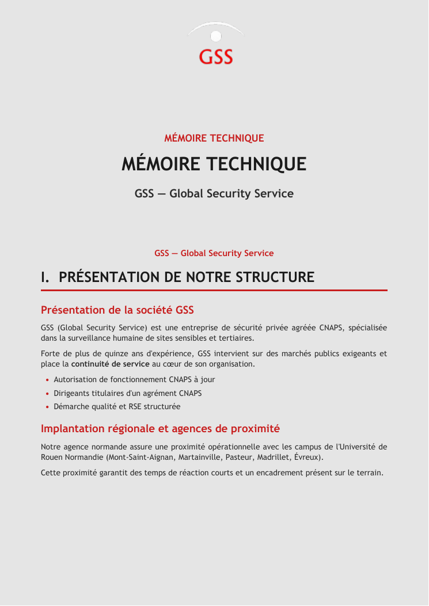
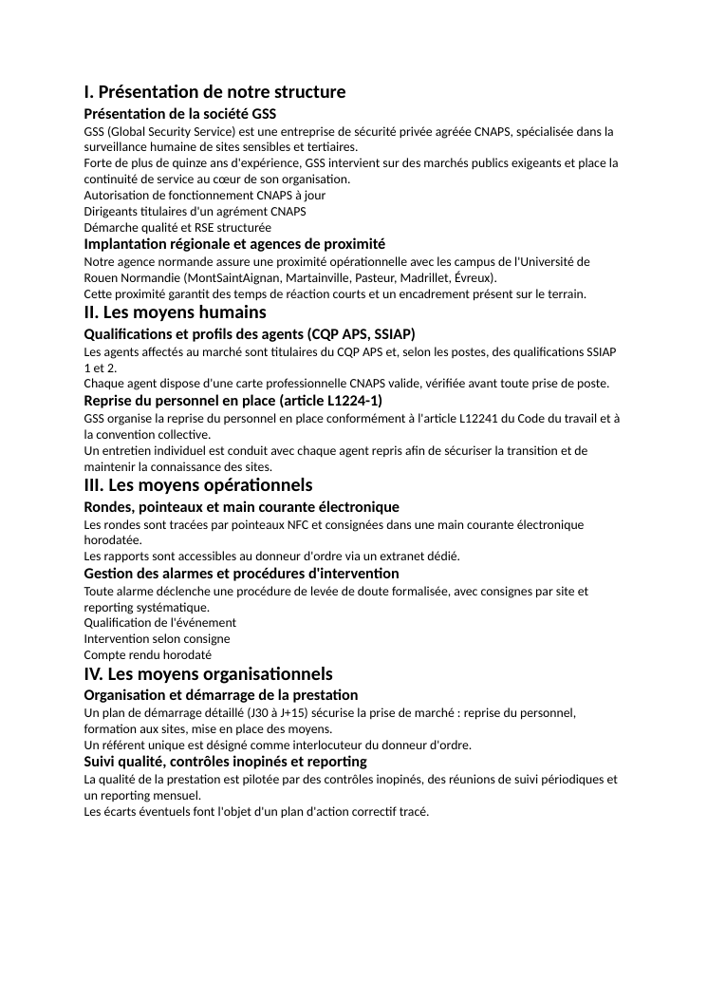

# V1 — Comparatif : template refondu vs génération sans template

> Phase 4. Deux DOCX produits à partir du **même contenu** (cas Université de Rouen
> Normandie MP2026-08), pour isoler l'apport réel du template.
> Sources : [data/output/v1_with_template.docx](../data/output/v1_with_template.docx) (Mode A, template refondu) et
> [data/output/v1_no_template.docx](../data/output/v1_no_template.docx) (Mode B, nu).

## Captures côte-à-côte (page 1)

| Mode A — template refondu | Mode B — sans template |
|---|---|
|  |  |
| 16,1 Ko | 2,5 Ko |

## Grille de comparaison

| Élément | Mode A (template refondu) | Mode B (sans template) |
|---|---|---|
| Page de garde (titre, bandeau, client) | ✅ label rouge « MÉMOIRE TECHNIQUE » + grand titre + client | ❌ absente — démarre direct au chapitre I |
| En-tête répétitif | ✅ bandeau GSS (image2.png) sur chaque page | ❌ aucun |
| Pied de page | ❌ (non implémenté) | ❌ (non implémenté) |
| Numérotation des pages | ❌ (non implémentée) | ❌ (non implémentée) |
| Hiérarchie typographique (H1/H2/H3) | ✅ chapitre (grand, filet rouge) / section (rouge) / corps distincts | ⚠️ gras + 2 tailles seulement, pas de styles Heading |
| Listes à puces / numérotées | ✅ puces rouges, retraits | ❌ markdown aplati en lignes de texte |
| Gras / italique inline | ✅ rendu | ⚠️ markdown `**` supprimé (texte brut) |
| Tableaux signalétiques | ❌ (non générés) | ❌ (non générés) |
| Sommaire | ❌ (non généré) | ❌ (non généré) |
| Cohérence palette (fond gris uniforme) | ✅ fond `#E5E5E5` + accent rouge `#C81E1E` | ❌ blanc brut, aucune couleur |
| Police | ✅ Trebuchet MS (identité) | ⚠️ Calibri (défaut Word) |
| Poids du fichier | 16,1 Ko (header seul, 220 images retirées) | 2,5 Ko |

## 1. Ce que le template apporte

1. **Une page de garde** structurée : label « MÉMOIRE TECHNIQUE », titre du marché, nom du client, signature GSS.
2. **Une identité visuelle de marque** : bandeau d'en-tête GSS répété sur chaque page (via `word/header1.xml` + `headerReference`).
3. **Un fond gris uniforme** (`#E5E5E5`) cohérent sur tout le document, avec affichage activé (`displayBackgroundShape`).
4. **Une hiérarchie typographique lisible** : chapitres (grand titre + filet rouge d'accent), sections (rouge GSS), corps justifié — niveaux nettement distincts.
5. **Le rendu des listes** (puces rouges, retraits) et du **gras/italique inline** (markdown interprété).
6. **Une police de marque** (Trebuchet MS) homogène, héritée du paquet de référence (styles/thème valides).
7. **Un fichier propre et léger** : les 220 images décoratives du template d'origine sont retirées (18 Mo → 16 Ko) tout en conservant le bandeau.

## 2. Ce qui manque quand on génère sans template

1. **Aucune page de garde** : le document s'ouvre directement sur « I. Présentation de notre structure ».
2. **Aucune identité visuelle** : pas de bandeau, pas de logo, pas d'en-tête — rien ne rattache le document à GSS.
3. **Aucune cohérence chromatique** : fond blanc, texte noir, zéro accent — rendu « brouillon ».
4. **Hiérarchie pauvre** : les titres ne sont que du gras de taille variable ; pas de styles Heading → **pas de sommaire automatique possible** dans Word.
5. **Listes perdues** : les puces markdown (`- …`) sont aplaties en lignes de texte continues.
6. **Markdown inline ignoré** : `**gras**` apparaît tel quel ou est supprimé, pas mis en forme.
7. **Police par défaut** (Calibri) au lieu de l'identité de marque.

### Top 3 carences (sans template)
1. **Page de garde absente** (impression non finie / non professionnelle).
2. **Identité visuelle / en-tête absents** (aucun rattachement à GSS sur les pages).
3. **Hiérarchie typographique et listes dégradées** (lisibilité et structure faibles, pas de sommaire possible).

## 3. Recommandations pour combler les carences

1. **Page de garde minimale sans template** : générer programmatiquement un titre + client + date + signature GSS en tête du DOCX nu (réutiliser `buildCoverXml` avec une palette sobre).
2. **Styles Heading réels** : injecter un `word/styles.xml` définissant `Heading1/2/3` et appliquer `<w:pStyle>` aux titres → hiérarchie native **et sommaire automatique** (`TOC`) possibles.
3. **Préserver les listes** : injecter un `word/numbering.xml` minimal et émettre de vraies puces/numéros plutôt que d'aplatir le markdown.
4. **Pied de page + numérotation** : ajouter un `footer1.xml` avec un champ `PAGE` (utile **aux deux modes**, actuellement absent partout).
5. **En-tête léger même sans template** : embarquer un petit logo/texte GSS et une police de marque, pour conserver un minimum d'identité quand aucun template n'est disponible.

> Conclusion : le template n'apporte pas du « contenu » (identique dans les deux cas) mais
> toute la **mise en forme structurante** — page de garde, identité visuelle, hiérarchie,
> listes, cohérence chromatique. Sans lui, la sortie reste exploitable comme brouillon de
> contenu mais n'est pas livrable en l'état à un acheteur public.
